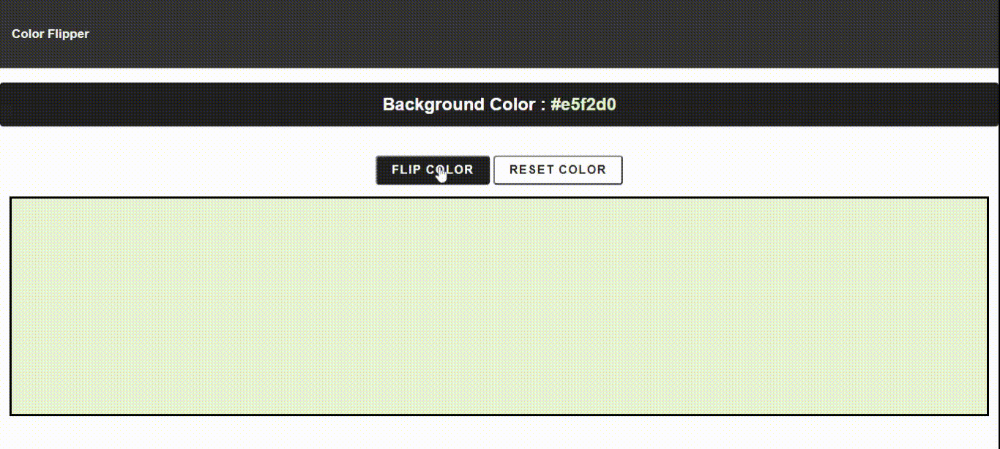

## COLOR FLIPPER

* This is a simple Color Flipper which generates random digit and a random alphabet and uses six such random generations to produce a Hex color.

* Every click on the **FLIP COLOR** button generates a new hex code and thus displays the respective color in the box below.

* Clicking on **RESET COLOR** button generates a hex code equivalent to White color.

* A sction above these button displays the hex string generated by the program.

